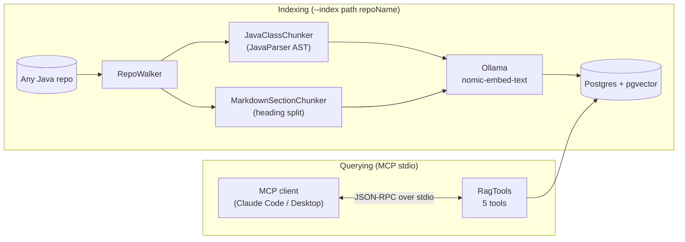

# codebase-rag-mcp

[](https://github.com/leon-lourenco/codebase-rag-mcp/actions/workflows/ci.yml)

**Case study:** [leon-lourenco.github.io/codebase-rag-mcp](https://leon-lourenco.github.io/codebase-rag-mcp/) — the architecture, the design decisions, and the real protocol bug that got caught along the way.

A repo-agnostic RAG server exposed over the Model Context Protocol: point it at any Java
codebase, it indexes the code and docs into a local vector store, and a real MCP client
(Claude Code, Claude Desktop) gets five read-only tools to search and browse that codebase
instead of having a human paste files into the conversation. It was built to index this
author's own portfolio repos, but nothing in it is specific to them — chunking is driven by
file type, not by any one repo's folder conventions.

This is a portfolio project by [Leonardo Lourenço Gomes](https://www.linkedin.com/in/leonardo-lourenço-gomes),
a senior backend engineer, built in public in scoped phases. Everything runs locally — Postgres
with pgvector, Ollama for embeddings — with no hosted demo and no infrastructure billed by the
hour.

## Status

- [x] **Indexer**: file-type-based chunking (JavaParser AST for `.java`, heading sections for
      `.md`), embeddings via Ollama, storage in pgvector.
- [x] **Five MCP tools**: `list_indexed_repos`, `search_code`, `get_file`, `list_structures`,
      `explain_concept` — pure retrieval, no server-side LLM calls.
- [x] **Verified over the real MCP wire protocol** — initialize, `tools/list`, and `tools/call`
      round-tripped correctly over stdio JSON-RPC against a running instance.
- [x] **Indexed across all five of this author's portfolio repos** — 2,706 chunks total.
- [x] **`--eval` harness**: 20 fixed questions across every indexed repo, scored by keyword
      match. Built and committed; not run against a live API key yet — it's optional
      infrastructure for this one harness, not something the server itself needs.
- [ ] Connected to a real Claude Code/Desktop session end to end (verified so far at the
      protocol level, not yet in an actual client UI).

## Why this exists

Every other repo in this portfolio is a normal engineering project. This one is different on
purpose: it's the tool used *to build the others* — a way to ask "where did I implement X" or
"how does this ledger's idempotency actually work" across four separate Java repos without
manually opening files or re-explaining the codebase's shape every session. Building it also
meant working with two things released after most training data existed for them: Spring AI
2.0's MCP server support, and the Model Context Protocol itself — so parts of this had to be
verified against the actual jars and a live wire-level test rather than assumed from memory
(see [Design decisions](#design-decisions) below).

## Architecture



Two independent flows sharing one store. `--index` is a one-shot CLI run: point it at a repo,
it walks the tree, hands each file to whichever chunker supports its extension, embeds every
chunk, and writes it to `vector_store` tagged with repo/path/symbol/type metadata. The same jar,
run with no arguments, starts as an MCP server over stdio instead — the default `CommandLineRunner`
branch just returns immediately when `--index` isn't present, so one artifact serves both jobs.

## Design decisions

### Chunking by file type, not by convention

The obvious way to index "my portfolio repos" would be to special-case each one's folder layout
— `pix-payment-gateway` has two Maven projects, `design-patterns-project` groups by GoF
category, `data-structures-project` groups by data structure family. Hard-coding any of that
would mean the indexer breaks the moment a new repo has a different shape, and it directly
contradicts the point of building this at all: one tool for every repo, not one config per repo.

Instead, [`RepoWalker`](src/main/java/com/coderag/indexing/RepoWalker.java) just walks the
tree and skips build/VCS noise (`target`, `build`, `.git`, `node_modules`, …), and each file
is handed to whichever [`FileChunker`](src/main/java/com/coderag/indexing/FileChunker.java)
claims its extension. [`JavaClassChunker`](src/main/java/com/coderag/indexing/JavaClassChunker.java)
parses with [JavaParser](https://github.com/javaparser/javaparser) and emits one chunk per
class/interface/enum/record declaration at any nesting level — a real AST, not brace-counting,
so it doesn't break on a brace inside a string literal or a comment.
[`MarkdownSectionChunker`](src/main/java/com/coderag/indexing/MarkdownSectionChunker.java)
splits on heading boundaries. Adding a Python or Go repo later is a third `FileChunker`
implementation, not a rewrite.

### The server never calls its own LLM

It would have been easy to make `explain_concept` synthesize an actual explanation server-side
— retrieve some chunks, call Claude, return prose. That's the wrong shape for an MCP tool. The
protocol's whole model is that the *client* is the LLM: Claude Code or Claude Desktop already
has a model in the loop, already has the conversation's context, and can reason over whatever
the tool hands back. A tool that quietly makes its own LLM call duplicates that cost and
latency, and produces an explanation with no visibility into how it was derived.

Every tool in [`RagTools`](src/main/java/com/coderag/tools/RagTools.java) — including
`explain_concept` — returns raw retrieval results: matched chunks, their scores, their symbols.
`explain_concept` is a little more layered than a plain similarity search (it checks for an
exact symbol match first, then supplements with semantic search), but it still hands back
evidence, not an answer. The one place an LLM does get called is the optional `--eval` harness,
and only because it's standing in for what a real client would do, to check the pipeline works
end to end without a human asking the same 20 questions by hand.

### stdout is reserved — and the framework didn't know that by default

The MCP stdio transport uses stdout exclusively for JSON-RPC messages; anything else on that
stream corrupts the protocol for whatever's parsing it line by line. This surfaced as a real
bug, not a hypothetical one: the first live test against a running process — piping a real
`initialize` → `tools/list` → `tools/call` sequence into stdin and reading stdout back out —
showed Spring Boot's startup banner and INFO/WARN log lines interleaved with the JSON-RPC
responses. A real client would have failed to parse the very first line.

The fix is [`logback-spring.xml`](src/main/resources/logback-spring.xml), which routes every
log appender to stderr instead of the default stdout console appender, plus
`spring.main.banner-mode: off`. Re-running the same test afterward produced exactly six lines
of output — six valid JSON-RPC responses, nothing else — confirmed by grepping for stray
non-JSON lines in the captured output rather than just eyeballing it. See
[Verifying it for real](#verifying-it-for-real) below for the actual transcript.

## The five tools

| Tool | What it does |
|---|---|
| `list_indexed_repos` | Every indexed repo with file and chunk counts — the discovery entry point. |
| `search_code` | Semantic search over indexed chunks, optionally scoped to one repo. |
| `get_file` | Every indexed chunk for one file, by repo + path. |
| `list_structures` | Every indexed symbol (class, interface, enum, record, or markdown heading), optionally scoped to one repo — for browsing before searching. |
| `explain_concept` | Exact symbol match plus related semantic search results for a named concept — raw evidence for the calling LLM to build an explanation from. |

## Verifying it for real

No MCP client was available to drive interactively from inside this same session, so the
protocol itself was tested directly: a JSON-RPC `initialize` request, a `tools/list`, and four
`tools/call` requests were piped into the packaged jar's stdin, with stdout captured and stdin
held open long enough for the async server to actually respond (closing stdin immediately, as a
naive `cmd < file` does, triggers shutdown before the queued responses are flushed — an artifact
of how the test was driven, not of the server).

```
$ search_code(query="idempotent transaction creation via unique constraint", repo="pix-payment-gateway")
→ TransactionService.java, score 0.75

$ explain_concept(name="Observer")
→ exact match: design-patterns-project/behavioral/observer/README.md § "Observer" (score 1.0)
→ related:     WebhookNotifierObserver.java (score 1.0)

$ list_structures(repo="algorithms-project")
→ 598 symbols, including backtracking/n-queens's README sections and NQueensSolver
```

All four tool calls round-tripped correctly, scored sensibly, and returned real content pulled
from the indexed repos — not fixtures. `list_indexed_repos` on the same run reported:

| Repo | Files | Chunks |
|---|--:|--:|
| algorithms-project | 136 | 598 |
| codebase-rag-mcp | 10 | 10 |
| data-structures-project | 481 | 1,446 |
| design-patterns-project | 222 | 560 |
| pix-payment-gateway | 32 | 92 |
| **Total** | **881** | **2,706** |

## Tech stack

Java 21, Spring Boot 4.1, Spring AI 2.0 (MCP server, pgvector store, Ollama + Anthropic model
starters), JavaParser, PostgreSQL + pgvector, Ollama (`nomic-embed-text`, 768 dimensions,
fully local), Testcontainers, JUnit 5, Docker Compose. Maven Wrapper is committed, so `./mvnw`
works without installing Maven.

## Running it

### Bring up Postgres and Ollama

```bash
docker compose up -d
```

Brings up pgvector-enabled Postgres and Ollama, and pulls `nomic-embed-text` into Ollama on
first run (a few hundred MB, one time).

### Index a repo

```bash
./mvnw spring-boot:run -Dspring-boot.run.arguments="--index /path/to/some-repo some-repo-name"
```

Walks the repo, chunks every `.java` and `.md` file, embeds each chunk, and writes it to
`vector_store` tagged with `some-repo-name`. Exits cleanly when done — this is a one-shot CLI
run, not the server.

### Run it as an MCP server

Point an MCP client at the packaged jar:

```json
{
  "mcpServers": {
    "codebase-rag": {
      "command": "java",
      "args": ["-jar", "/path/to/codebase-rag-mcp-0.0.1-SNAPSHOT.jar"]
    }
  }
}
```

No API key required for this — the server only retrieves data; the client supplies the LLM.
Requires Postgres and Ollama from `docker compose up -d` to be running.

### Tests

```bash
./mvnw test
```

The context-load test spins up real Postgres and Ollama via Testcontainers — no manual setup,
but it does need a Docker daemon running locally.

### `--eval` harness (optional)

```bash
ANTHROPIC_API_KEY=sk-ant-... ./mvnw spring-boot:run -Dspring-boot.run.arguments="--eval"
```

Runs the 20 fixed questions in [`EvalQuestions`](src/main/java/com/coderag/eval/EvalQuestions.java),
retrieving context the same way `search_code` would and asking Claude to answer from it alone,
then scoring by keyword presence. This is the one code path in the whole app that calls an LLM
directly, and only because it's standing in for a real MCP client to check the pipeline
automatically. Needs its own `ANTHROPIC_API_KEY` — unrelated to, and not required for, using the
server itself.

## Project structure

```
codebase-rag-mcp/
├── docker-compose.yml          Postgres+pgvector, Ollama, one-shot model pull
├── docs/                        GitHub Pages case study
└── src/main/java/com/coderag/
    ├── indexing/                RepoWalker, FileChunker, JavaClassChunker, MarkdownSectionChunker, RepoIndexer
    ├── tools/                   RagTools — the five MCP tools
    └── eval/                    EvalQuestion, EvalQuestions, EvalRunner (--eval harness)
```
